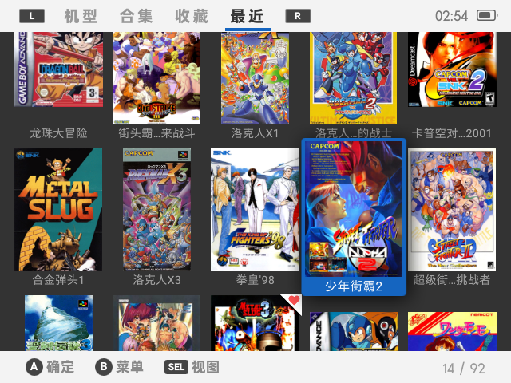

# Retro Fans v0.1
[Pegasus](https://pegasus-frontend.org) theme for the Retroid Pocket 2/2+.
forked from [Retro Mega](https://github.com/djfumberger/retromega), thanks to djfumberger

专为Retroid Pocket2/2+适配的Pegasus(天马前端)主题
本主题来源于Retro Mega, 本人在原作者的基础上进行了修改，适配，更符合本土使用习惯。
原本只是自己使用的，因有朋友有兴趣就放出来供使用和完善

## 安装

[下载](https://github.com/djfumberger/retromega/archive/main.zip) 解压到pegasus前端的主题(theme)文件夹中 [theme directory](http://pegasus-frontend.org/docs/user-guide/installing-themes). 在天马前端的设置界面中选择.

推荐配合“挖坑者联盟”整合的游戏合集使用, 已经适配了绝大部分机型的图片

## 特性 
* 专门RP2/2+的屏幕分辨率适配和优化.
* 首页分为：机型、合集、收藏、最近四个标签页.
* 机型、合集可以切换网格视图/海报视图(原Retro Mega).
* 游戏列表页面可以切换网格视图/列表视图(原Retro Mega).
* 新增的合集展示功能，方便把一个系列的游戏放在一起，打造自己喜爱系列的专辑.
* 支持英文、中文(目前需要手动修改配置)

## 使用说明
* 基本操作可参见主题下方的按键提示
* 列表可以使用方向左右键翻页

## 机型、合集的添加方法
### 机型：

### 合集：

## 升级计划
* 适配高分辨率屏幕.
* 多语言支持界面切换.
* 增加更多机型、合集的图片及颜色定义.

## 版本历史

### v0.1

初测发布

## License

## 截图
#### 机型网格视图
  

#### 合集网格视图
  

#### 收藏
  

#### 最近游玩
  

#### 机型卡片视图
  
  
  
  

#### 合集卡片视图
  

#### 游戏网格视图
  

#### 游戏列表视图
  

#### 游戏详情页
  

#### 游戏列表排序
  

#### 游戏详情页
  

#### 游戏介绍全文
  

